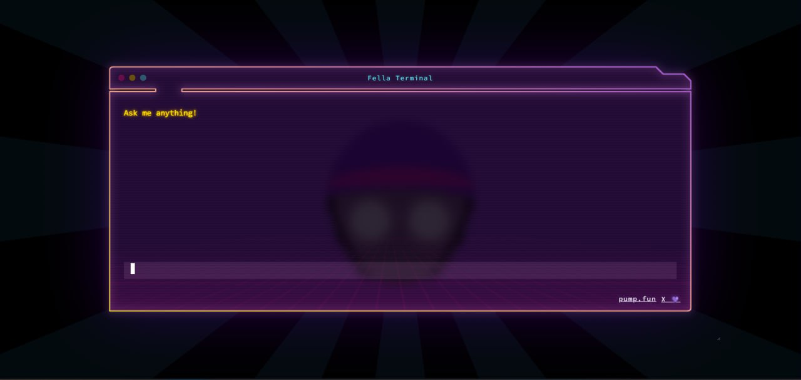

<p align="center">
  
</p>

<h1 align="center"> Fella Terminal - AI remnants of my past humanity </h1>




## Table of Contents

- [About](#about)
- [Key Features](#key-features)
- [System Architecture](#system-architecture)
- [Getting Started](#getting-started)
  - [Requirements](#requirements)
  - [Installation](#installation)
  - [How to use](#how-to-use)
- [Configuration](#configuration)


## About

Fellaterminal is an advanced AI software engineer that can understand high-level human instructions, break them down into steps, research relevant information, and write code to achieve the given objective. fellaterminal utilizes large language models, planning and reasoning algorithms, and web browsing abilities to intelligently develop software.

Fellaterminal aims to revolutionize the way we build software by providing an AI pair programmer who can take on complex coding tasks with minimal human guidance. Whether you need to create a new feature, fix a bug, or develop an entire project from scratch, fellaterminal is here to assist you.


## Demos


## Key Features

- 🤖 Supports **Claude 3**, **GPT-4**, **Gemini**, **Mistral** , **Groq** and **Local LLMs** via [Ollama](https://ollama.com). For optimal performance: Use the **Claude 3** family of models.
- 🧠 Advanced AI planning and reasoning capabilities
- 🔍 Contextual keyword extraction for focused research
- 📊 Dynamic agent state tracking and visualization
- 💬 Natural language interaction via chat interface
- 🔌 Extensible architecture for adding new features and integrations

## System Architecture

Read [**README.md**](docs/architecture) for the detailed documentation.


## Getting Started

### Requirements
```
Version's requirements
  - Python >= 3.10 and < 3.12
  - NodeJs >= 18
  - bun
```

- Install uv - Python Package manager [download](https://github.com/astral-sh/uv)
- Install bun - JavaScript runtime [download](https://bun.sh/docs/installation)
- For ollama [ollama setup guide](docs/Installation/ollama.md) (optinal: if you don't want to use the local models then you can skip this step)
- For API models, configure the API keys via setting page in UI.


### Installation

To install fellaterminal, follow these steps:

1. Clone the fellaterminal repository:
   ```bash
   git clone https://github.com/fellaterminal/fellaterminal.git
   ```
2. Navigate to the project directory:
   ```bash
   cd fellaterminal
   ```
3. Create a virtual environment and install the required dependencies (you can use any virtual environment manager):
   ```bash
   uv venv
   
   # On macOS and Linux.
   source .venv/bin/activate

   # On Windows.
   .venv\Scripts\activate

   uv pip install -r requirements.txt
   ```
4. Install the playwright for browsering capabilities:
   ```bash
   playwright install --with-deps # installs browsers in playwright (and their deps) if required
   ```
5. Start the fellaterminal server:
   ```bash
   python fellaterminal.py
   ```
6. if everything is working fine, you see the following output:
   ```bash
   root: INFO   : fellaterminal is up and running!
   ```
7. Now, for frontend, open a new terminal and navigate to the `ui` directory:
   ```bash
   cd ui/
   bun install
   bun run start
   ```
8. Access the fellaterminal web interface by opening a browser and navigating to `http://127.0.0.1:3001`

### how to use

To start using fellaterminal, follow these steps:

1. Open the fellaterminal web interface in your browser.
2. To create a project, click on 'select project' and then click on 'new project'.
3. Select the search engine and model configuration for your project.
4. In the chat interface, provide a high-level objective or task description for fellaterminal to work on.
5. fellaterminal will process your request, break it down into steps, and start working on the task.
6. Monitor fellaterminal's progress, view generated code, and provide additional guidance or feedback as needed.
7. Once fellaterminal completes the task, review the generated code and project files.
8. Iterate and refine the project as desired by providing further instructions or modifications.

## Configuration

fellaterminal requires certain configuration settings and API keys to function properly:

when you first time run fellaterminal, it will create a `config.toml` file for you in the root directory. You can configure the following settings in the settings page via UI:

- API KEYS
   - `BING`: Your Bing Search API key for web searching capabilities.
   - `GOOGLE_SEARCH`: Your Google Search API key for web searching capabilities.
   - `GOOGLE_SEARCH_ENGINE_ID`: Your Google Search Engine ID for web searching using Google.
   - `OPENAI`: Your OpenAI API key for accessing GPT models.
   - `GEMINI`: Your Gemini API key for accessing Gemini models.
   - `CLAUDE`: Your Anthropic API key for accessing Claude models.
   - `MISTRAL`: Your Mistral API key for accessing Mistral models.
   - `GROQ`: Your Groq API key for accessing Groq models.
   - `NETLIFY`: Your Netlify API key for deploying and managing web projects.

- API_ENDPOINTS
   - `BING`: The Bing API endpoint for web searching.
   - `GOOGLE`: The Google API endpoint for web searching.
   - `OLLAMA`: The Ollama API endpoint for accessing Local LLMs.
   - `OPENAI`: The OpenAI API endpoint for accessing OpenAI models.

Make sure to keep your API keys secure and do not share them publicly. For setting up the Bing and Google search API keys, follow the instructions in the [search engine setup](docs/Installation/search_engine.md)
